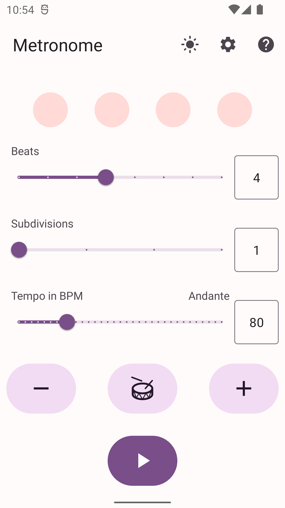
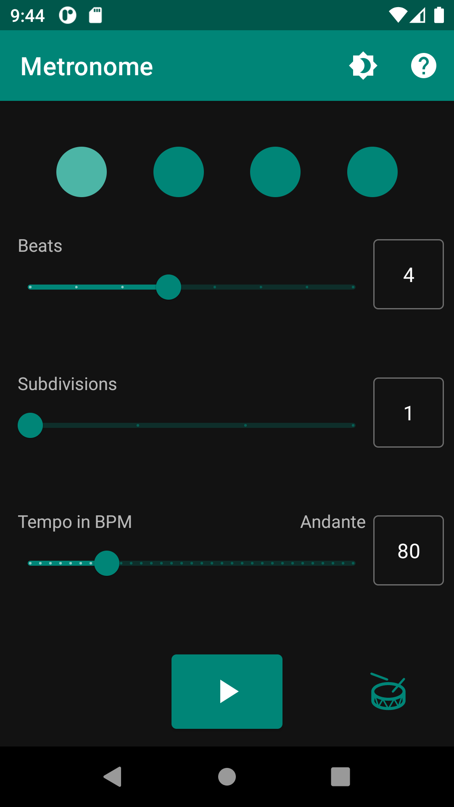

# Metronome

This project is intended to offer a simple and good looking metronome for Android.

## Screenshots

## Features

* Adjustable beats and subdivisions
* Beat visualization
* Tap tempo
* Automatic night mode
* No advertisements
* No annoyance

## License

The project is licensed under the GNU GPL v3. You can find the license text in the LICENSE file.
